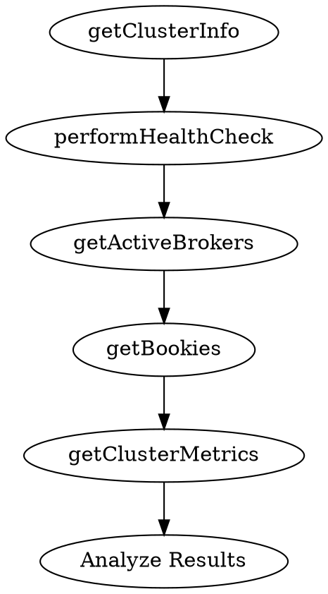

# Cluster Health Check Skill

## Overview

Perform comprehensive health checks on Apache Pulsar clusters, including brokers, bookies, topics, and overall system health.

## When to Use

Use this skill when:
- User asks for cluster health status
- Regular health monitoring
- After maintenance or configuration changes
- Troubleshooting cluster issues

## Process

Follow these steps in order:

### 1. Check Core Components



Call these tools in sequence:
1. `getClusterInfo()` - Basic cluster information
2. `performHealthCheck()` - Health check
3. `getActiveBrokers()` - Broker status
4. `getBookies()` - Bookie status
5. `getClusterMetrics()` - Current metrics

### 2. Evaluate Health Status

For each component, determine:
- **HEALTHY** - All checks pass
- **WARNING** - Minor issues detected
- **CRITICAL** - Major issues or component down

### 3. Generate Health Report

```
## Cluster Health Report

### Overall Status: [HEALTHY/WARNING/CRITICAL]

### Components

#### Brokers
- Status: [HEALTHY/WARNING/CRITICAL]
- Active count: X/Y
- Issues: [list any]

#### Bookies
- Status: [HEALTHY/WARNING/CRITICAL]
- Total: X, Writable: Y, Read-only: Z
- Issues: [list any]

#### Topics
- Total topics: X
- Topics with backlog: Y
- Issues: [list any]

### Recommendations
1. [Priority recommendations based on findings]
```

## Available Tools

| Tool | Purpose |
|------|---------|
| `getClusterInfo` | Get overall cluster information |
| `performHealthCheck` | Run health check on all components |
| `getActiveBrokers` | List active brokers |
| `getBookies` | List bookies with status |
| `getClusterMetrics` | Get cluster-wide metrics |
| `quickHealthSnapshot` | Quick health status |

## Deep Analysis Option

When user requests deep analysis:
- Call `analyzeBrokerLogs()` for log analysis
- Call `getBrokerMetrics()` for detailed broker metrics
- Check for error patterns in logs

## Red Flags

- Zero active brokers
- All bookies read-only
- High error rates in logs
- Memory/CPU critical levels