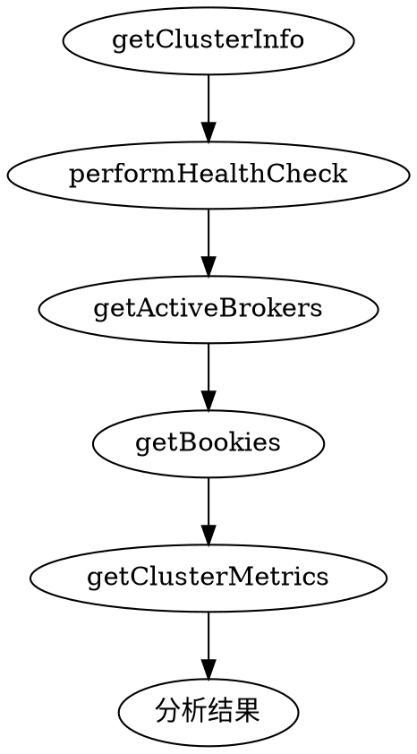

# 集群健康检查技能

## 概述

对Apache Pulsar集群进行全面健康检查，包括Broker、Bookie、主题和整体系统健康状况。

## 适用场景

在以下情况下使用此技能：
- 用户询问集群健康状态
- 定期健康监控
- 维护或配置更改后
- 排查集群问题

## 处理流程

按顺序执行以下步骤：

### 1. 检查核心组件



按顺序调用这些工具：
1. `getClusterInfo()` - 基本集群信息
2. `performHealthCheck()` - 健康检查
3. `getActiveBrokers()` - Broker状态
4. `getBookies()` - Bookie状态
5. `getClusterMetrics()` - 当前指标

### 2. 评估健康状态

对每个组件确定：
- **健康** - 所有检查通过
- **警告** - 检测到轻微问题
- **严重** - 主要问题或组件宕机

### 3. 生成健康报告

```
## 集群健康报告

### 整体状态：[健康/警告/严重]

### 组件详情

#### Brokers
- 状态：[健康/警告/严重]
- 活跃数量：X/Y
- 问题：[列出任何问题]

#### Bookies
- 状态：[健康/警告/严重]
- 总数：X，可写：Y，只读：Z
- 问题：[列出任何问题]

#### 主题
- 主题总数：X
- 有积压的主题：Y
- 问题：[列出任何问题]

### 建议措施
1. [根据发现提供优先建议]
```

## 可用工具

| 工具 | 用途 |
|------|------|
| `getClusterInfo` | 获取集群整体信息 |
| `performHealthCheck` | 对所有组件运行健康检查 |
| `getActiveBrokers` | 列出活跃的Broker |
| `getBookies` | 列出Bookie及其状态 |
| `getClusterMetrics` | 获取集群范围指标 |
| `quickHealthSnapshot` | 快速健康状态 |

## 深度分析选项

当用户请求深度分析时：
- 调用 `analyzeBrokerLogs()` 进行日志分析
- 调用 `getBrokerMetrics()` 获取详细Broker指标
- 检查日志中的错误模式

## 警告信号

- 零活跃Broker
- 所有Bookie只读
- 日志中错误率高
- 内存/CPU达到严重级别