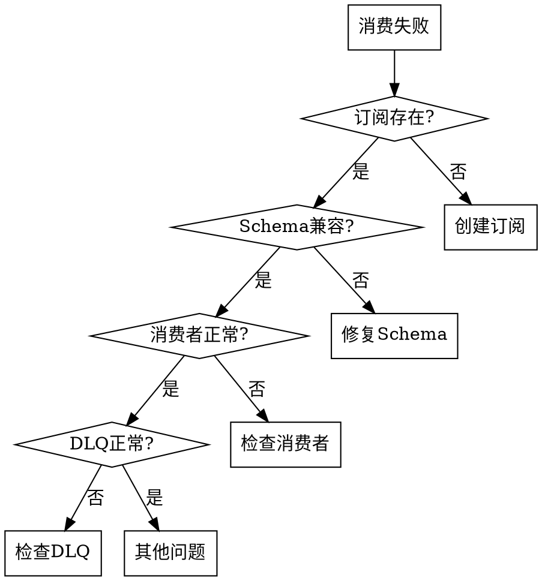

# 消费失败诊断

## 概述

诊断 Apache Pulsar 消息消费失败问题，识别导致消费异常、无法消费的错误原因。

## 适用场景

在以下情况下使用此技能：
- 消息消费失败
- 消费者异常
- 无法消费消息
- 消费超时

## 错误类型分析

| 错误类型 | 症状 | 可能原因 |
|----------|------|----------|
| SchemaMismatchException | 反序列化失败 | Schema 不兼容 |
| ConsumerBusyException | 订阅冲突 | 多消费者竞争 Exclusive 订阅 |
| SubscriptionNotFoundException | 订阅不存在 | 订阅未创建或已删除 |
| BrokerUnloadedException | Broker 切换 | Topic 卸载重载 |
| DLQException | 死信失败 | DLQ 配置错误 |

## 处理流程

### 1. 错误识别

```
diagnoseConsumeFailed(resource?) → 消费失败诊断
getConsumerStats(topic) → 消费者状态
checkSubscription(topic, subscription) → 订阅检查
getDlqStats(topic) → DLQ 状态
```

### 2. 分步诊断



### 3. 详细检查

#### Schema 问题
```bash
# 检查 Schema
pulsar-admin schemas get <topic>

# 更新 Schema
pulsar-admin schemas upload <topic> -f schema.json

# 删除 Schema（谨慎使用）
pulsar-admin schemas delete <topic>
```

#### 订阅问题
```bash
# 检查订阅
pulsar-admin topics subscriptions <topic>

# 创建订阅
pulsar-admin topics create-subscription <topic> -s <subscription>

# 重置订阅
pulsar-admin topics reset-cursor <topic> -s <subscription> -t <time>
```

#### DLQ 问题
```bash
# 检查 DLQ 配置
pulsar-admin topics get-delayed-delivery <topic>
```

### 4. 生成诊断报告

```
## 消费失败诊断报告

### 错误信息
- 错误类型：[异常类型]
- 错误消息：[详细消息]
- 受影响资源：[Topic/Subscription]

### 诊断结果
- 订阅状态：[存在/不存在]
- Schema 状态：[兼容/不兼容]
- 消费者状态：[正常/异常]
- DLQ 状态：[正常/异常]

### 根本原因
[识别的根本原因]

### 解决方案
1. [立即修复步骤]
2. [配置建议]
3. [预防措施]
```

## 常见错误解决

### Schema 不兼容
```bash
# 检查 Schema 兼容性
pulsar-admin schemas get <topic>

# 使用 Schema 自动注册
# 或手动处理不同 Schema
```

### 订阅冲突
```bash
# 检查订阅类型
pulsar-admin topics subscriptions <topic>

# 切换订阅类型或增加消费者
```

### DLQ 配置
```java
// 消费者配置
DeadLetterPolicy.builder()
    .maxRedeliverCount(3)
    .deadLetterTopic("dlq-topic")
    .build()
```