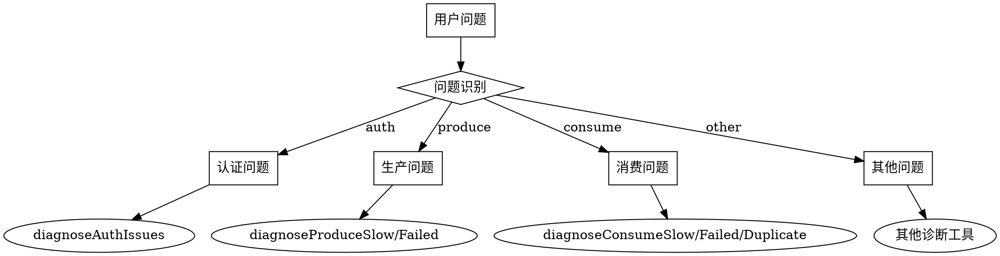

# Pulsar 故障诊断总入口

## 概述

这是 Pulsar 故障诊断的总入口技能，负责根据用户描述的问题现象，自动路由到对应的诊断子技能。

## 问题现象路由表

根据用户输入的关键词，路由到对应的子技能：

| 问题现象 | 子技能 | 关键词 |
|----------|--------|--------|
| 认证/鉴权问题 | `auth-issue` | 认证、权限、token、401、403、unauthorized |
| 生产慢 | `produce-slow` | 生产慢、发送慢、写入慢、发送延迟 |
| 生产失败 | `produce-failed` | 生产失败、发送失败、写入失败、发送异常 |
| 消费慢 | `consume-slow` | 消费慢、积压、backlog、lag、消息堆积 |
| 消费失败 | `consume-failed` | 消费失败、消费异常、无法消费 |
| 消费重复 | `consume-duplicate` | 消费重复、重复消费、重复消息 |
| 集群健康 | `cluster-health` | 健康、状态、检查、监控 |
| 磁盘问题 | `disk-issue` | 磁盘、空间、满、存储、no space |
| 容量规划 | `capacity-planning` | 容量、扩容、规划、资源 |
| 主题咨询 | `topic-consultation` | 主题、分区、保留、配置 |

## 处理流程

### 1. 问题识别

首先分析用户输入，识别问题现象：

```
用户输入 → 关键词匹配 → 问题现象分类
```

### 2. 路由分发

根据问题现象，调用对应的诊断工具：



### 3. 结果聚合

如果涉及多个问题，聚合多个诊断结果：

```
综合报告 = Σ 子诊断结果
```

## 使用示例

### 示例 1: 单一问题

**用户**: "我的消息消费很慢，积压越来越多了"

**路由**: `consume-slow` → 调用 `diagnoseConsumeSlow()`

### 示例 2: 复合问题

**用户**: "生产失败了，可能是权限问题"

**路由**: `produce-failed` + `auth-issue` → 并行调用诊断

## 子技能说明

### 认证/鉴权问题 (auth-issue)
- **位置**: `skills/auth/SKILL.md`
- **工具**: `diagnoseAuthIssues`
- **场景**: Token 问题、权限不足、认证配置错误

### 生产问题 (produce-*)
- **位置**: `skills/produce/slow/SKILL.md`, `skills/produce/failed/SKILL.md`
- **工具**: `diagnoseProduceSlow`, `diagnoseProduceFailed`
- **场景**: 发送延迟高、生产异常

### 消费问题 (consume-*)
- **位置**: `skills/consume/slow/SKILL.md`, `skills/consume/failed/SKILL.md`, `skills/consume/duplicate/SKILL.md`
- **工具**: `diagnoseConsumeSlow`, `diagnoseConsumeFailed`, `diagnoseConsumeDuplicate`
- **场景**: 消费延迟、消费异常、重复消费

### 集群健康 (cluster-health)
- **位置**: `skills/cluster/health/SKILL.md`
- **场景**: 整体健康检查

### 磁盘问题 (disk-issue)
- **位置**: `skills/disk/SKILL.md`
- **工具**: `diagnoseDiskIssues`
- **场景**: 磁盘空间不足、I/O 问题

## 快速诊断

当无法确定问题类型时，使用综合诊断：

```
runComprehensiveDiagnostic() → 全面的系统检查
```

## 注意事项

1. 优先根据用户描述的**问题现象**路由，而非假设的根因
2. 如果问题模糊，先进行初步检查再深入诊断
3. 对于复合问题，可以并行调用多个诊断工具
4. 保持诊断结果的可操作性，提供明确的下一步建议