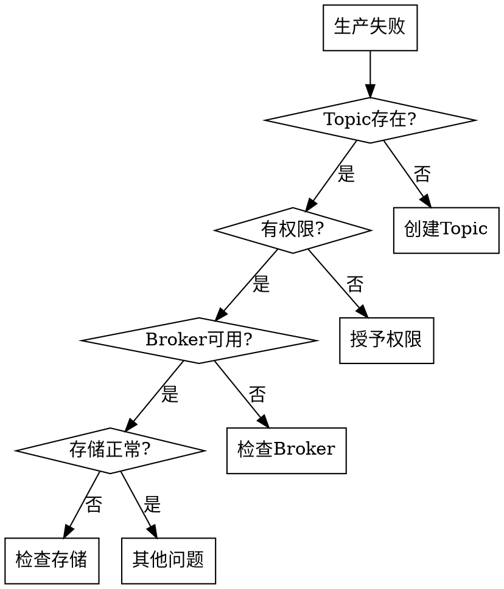

# 生产失败诊断

## 概述

诊断 Apache Pulsar 消息生产失败问题，识别导致发送异常、写入失败的错误原因。

## 适用场景

在以下情况下使用此技能：
- 消息发送失败
- 生产者异常
- 写入错误
- 生产操作被拒绝

## 错误类型分析

| 错误类型 | 症状 | 可能原因 |
|----------|------|----------|
| TopicNotFoundException | Topic 不存在 | Topic 未创建，自动创建关闭 |
| PermissionDeniedException | 权限不足 | 无生产权限 |
| BrokerNotAvailableException | Broker 不可用 | Broker 宕机或网络问题 |
| QuotaExceededException | 配额超限 | 达到速率或大小限制 |
| PersistenceException | 持久化失败 | 磁盘满，Bookie 问题 |

## 处理流程

### 1. 错误识别

```
diagnoseProduceFailed(topic?) → 生产失败诊断
getTopicInfo(topic) → Topic 状态
checkPermissions(resource) → 权限检查
inspectCluster() → 集群状态
```

### 2. 分步诊断



### 3. 详细检查

#### Topic 问题
```bash
# 检查 Topic 是否存在
pulsar-admin topics list <namespace>

# 创建 Topic
pulsar-admin topics create <topic>

# 检查 Topic 状态
pulsar-admin topics stats <topic>
```

#### 权限问题
```bash
# 检查权限
pulsar-admin topics permissions <topic>

# 授予生产权限
pulsar-admin topics grant-permission <topic> \
  --role <role> --action produce
```

#### Broker 问题
```bash
# 检查 Broker 状态
pulsar-admin brokers list
pulsar-admin brokers healthcheck
```

### 4. 生成诊断报告

```
## 生产失败诊断报告

### 错误信息
- 错误类型：[异常类型]
- 错误消息：[详细消息]
- 受影响资源：[Topic/Namespace]

### 诊断结果
- Topic 状态：[存在/不存在]
- 权限状态：[有权限/无权限]
- Broker 状态：[可用/不可用]
- 存储状态：[正常/异常]

### 根本原因
[识别的根本原因]

### 解决方案
1. [立即修复步骤]
2. [配置建议]
3. [预防措施]
```

## 常见错误解决

### Topic 不存在
```bash
# 开启自动创建
pulsar-admin namespaces set-auto-topic-creation <namespace> \
  --enable --type partitioned
```

### 权限不足
```bash
# 授予生产权限
pulsar-admin namespaces grant-permission <namespace> \
  --role <role> --actions produce
```

### 配额超限
```bash
# 检查配额
pulsar-admin namespaces get-message-ttl <namespace>
pulsar-admin topics get-backlog-quotas <topic>

# 调整配额
pulsar-admin namespaces set-backlog-quota <namespace> \
  --limit <size> --policy producer_exception
```

### 磁盘满
- 清理旧数据
- 扩展存储
- 调整保留策略